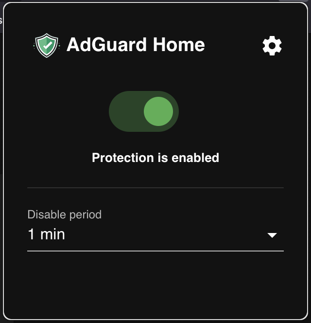
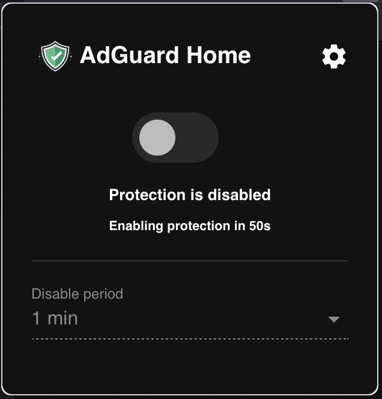
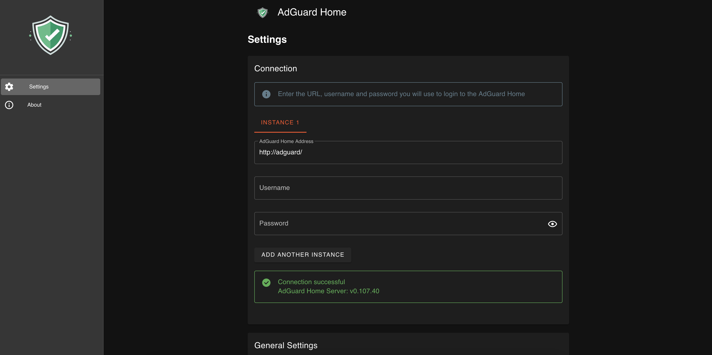

<h2 align="center"><b>AdGuard Home Control</b></h2>
<h4 align="center">Extension to control AdGuard Home DNS from your browser</h4>

## AdGuard Home Control
This extension controls the protection of [AdGuard Home](https://github.com/AdguardTeam/AdGuardHome) right from your browser.

## Features:
✓ Disable protection for specific time  
✓ Supports multiple instances  
✓ Tested in Mozilla Firefox, Google Chrome, Microsoft Edge browsers

## Build
Follow these instructions to build and run the project.

1. Clone this repository.
1. You need to have the latest version of npm.
1. Install cross-env, `npm install cross-env`
1. Run `npm run start-firefox` from the project folder
1. In firefox browser, go to `about:debugging` -> `Load Temporary Add-on`
1. Point to the `dist` -> `firefox` -> `mainifest.json`
1. This extension should now be visible in the  Extension in toolbar.

## Screenshots

   
   
   

## Contributing Guidelines
Read the contributing guidelines [here](CONTRIBUTING.md)

## Thanks
This project is inspired from the [PiHole browser extension](https://github.com/badsgahhl/pihole-browser-extension) project. 

## Disclaimer
This is not an official AdGuard Home application. AdGuard, AdGuard Home are registered trademarks of AdGuard Software Ltd. Use this product at your own risk. We are not responsible for any damages to your computer or AdGuard server that may be caused by using this product.